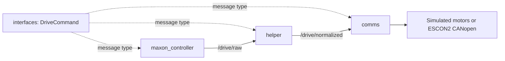

# Build a ROS 2 Humble Maxon command pipeline

Create **four packages** and complete numbered code blanks to send forward/turn commands to Maxon ESCON2 drives. This is a learner exercise: the workspace starts empty, starter files are intentionally incomplete, and the container supplies the tools rather than a finished application.



| Package | Your work |
| --- | --- |
| `interfaces` | Define `DriveCommand` with floating-point `forward` and `turn` fields |
| `maxon_controller` | Publish configurable raw inputs at 20 Hz |
| `helper` | Subscribe, reject nonfinite input, clamp each axis to [-1, 1], republish |
| `comms` | Subscribe, mix left/right levels, scale to rpm, encode CANopen SDO writes |

## Start here

Install Docker Desktop with Linux containers on **Windows (WSL 2)** or **macOS**, or Docker Engine + Compose v2 on **Linux/Raspberry Pi**. Fork and clone the repository, open a terminal in its root, then run:

```text
docker compose build
docker compose up -d
docker compose exec tutorial bash
```

Windows users can run these commands in PowerShell; the last command opens a Linux bash shell where all lesson commands work unchanged. No native ROS installation is needed. See [platform setup](docs/00-environment.md).

## Lessons

1. [Create the four packages](docs/01-create-packages.md)
2. [Define the custom interface — I01–I02](docs/02-interfaces.md)
3. [Publish raw commands — M01–M05](docs/03-maxon-controller.md)
4. [Normalize and republish — H01–H07](docs/04-helper.md)
5. [Convert commands to CANopen — C01–C07](docs/05-comms.md)
6. [Run and test the full pipeline](docs/06-run-pipeline.md)
7. [Move to the Raspberry Pi and real hardware](docs/07-hardware.md)

A Python blank looks like `TODO('M01')`. Replace the entire call with your expression; replace standalone TODO statements with the requested operation. Unfilled calls raise an error naming the blank. The message file has placeholder types that must be filled before it can build. Package metadata and drive safety support are supplied; your tasks are listed beside the blanks and in each lesson.

## What stays supplied

`comms/support/` handles drive preparation, explicit arming, command timeout, faults, and shutdown. Simulation is the default. Hardware requires explicit opt-in, a verified positive speed limit, and prior ESCON2 commissioning. This tutorial uses Autobot's four-motor ordering **FL, BL, FR, BR**, default node IDs **1, 3, 2, 4**, and sequential CANopen SDO transfers. A one-motor bench exercise selects only node 1. See [references](docs/references.md).

Windows and macOS run simulation/development locally. Real motor commands run inside the Pi's Linux container through SocketCAN; connect to that Pi using SSH. No direct Desktop USB/CAN passthrough is configured.

## Checks and layout

- `exercises/`: starter overlays to copy after creating packages.
- `ros2_ws/src/`: your workspace, initially empty.
- `tests/`: maintainer checks for the scaffold and supplied safety support.
- `scripts/`: build, checks, CAN host setup, and completed-pipeline smoke test.
- `compose.yaml`: shared Windows/macOS/Linux environment; `compose.pi.yaml`: Linux CAN networking overlay.

Run `bash scripts/check_template.sh` inside the container for maintainer checks. Run the lesson tests against your completed packages as described in the lessons. Passing template checks does not mean the blanks are completed. See [validation](docs/validation.md) and [contributing](CONTRIBUTING.md). Licensed under [Apache 2.0](LICENSE).
